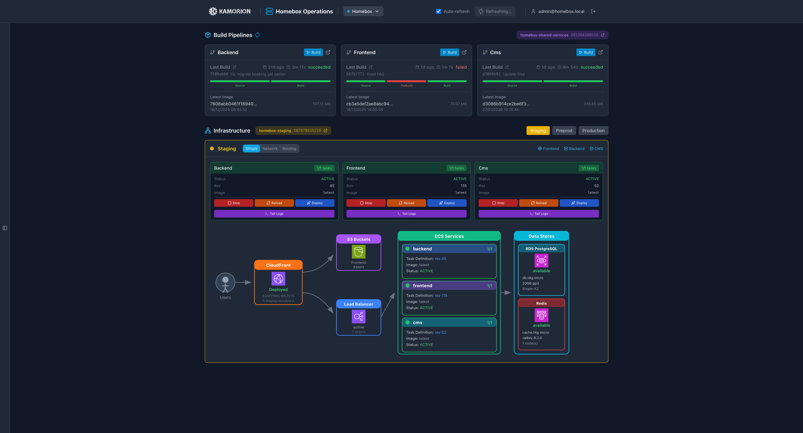
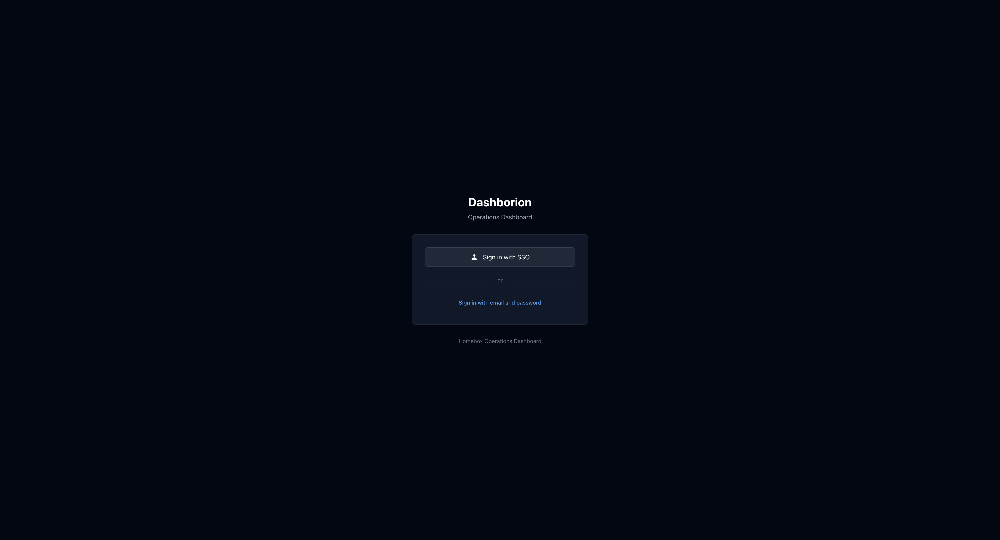

<p align="center">
  
</p>

<h1 align="center">Dashborion</h1>

<p align="center">
  <strong>Modern infrastructure operations dashboard for AWS ECS, EKS, and CI/CD pipelines</strong>
</p>

<p align="center">
  <a href="#features">Features</a> •
  <a href="#screenshots">Screenshots</a> •
  <a href="#quick-start">Quick Start</a> •
  <a href="#documentation">Documentation</a> •
  <a href="#contributing">Contributing</a>
</p>

<p align="center">
  
  
  
  
  
</p>

---

## Overview

Dashborion is a comprehensive infrastructure visualization and operations tool designed for DevOps teams managing AWS workloads. It provides real-time visibility into ECS services, infrastructure components, CI/CD pipelines, and enables quick operational actions—all through a modern web interface and CLI.

### Why Dashborion?

- **Single pane of glass** - View services, infrastructure, pipelines, and events in one place
- **Deep AWS integration** - Native support for ECS, ALB, RDS, ElastiCache, CloudFront, VPC
- **Multi-environment** - Switch between staging, preprod, and production instantly
- **Actionable** - Deploy, restart, scale services, invalidate caches, control RDS
- **Shareable URLs** - Deep-link to any view, service, or resource for collaboration
- **Secure by default** - Native SAML SSO, RBAC, audit logging

---

## Screenshots

### Simple View
Overview of services, pipelines, and infrastructure status at a glance.



### Network View
Detailed VPC topology with subnets, ENIs, security groups, and data stores.



### Routing View
Route tables, NAT gateways, VPC endpoints, and subnet associations.


---

## Features

### Web Dashboard

| Feature | Description |
|---------|-------------|
| **Services** | ECS services status, tasks, deployments, real-time logs |
| **Infrastructure** | ALB, RDS, ElastiCache, CloudFront, S3, VPC components |
| **Pipelines** | Build/deploy pipelines, ECR images, execution history |
| **Events Timeline** | CloudTrail, ECS events, deployments with filtering |
| **Network Explorer** | ENIs, security groups with expandable rules |
| **Quick Actions** | Deploy, restart, scale, invalidate cache, RDS control |
| **Deep-linking** | Bookmark and share any view or resource |
| **Native SSO** | Built-in SAML via Lambda@Edge (no external modules) |
| **RBAC** | Project/environment scoped roles (viewer, operator, admin) |

### CLI Tool

```bash
# Authentication
dashborion auth login              # Device flow (opens browser)
dashborion auth login --use-sso    # Reuse AWS SSO session
dashborion --sigv4 auth whoami     # Use AWS SigV4 (no stored token)
dashborion auth whoami             # Show current user

# Services
dashborion services list --env staging
dashborion services describe backend --env production

# Infrastructure
dashborion infra show --env staging --output json

# Diagrams
dashborion diagram generate --env staging --output architecture.png
dashborion diagram publish --confluence-page 12345

# Admin - Backup/Restore (with KMS encryption support)
dashborion admin backup -o ./backup --decrypt  # Decrypt for migration
dashborion admin restore -i ./backup --encrypt --kms-key arn:aws:kms:...
```

### Supported Platforms

| Compute | CI/CD | Storage |
|---------|-------|---------|
| AWS ECS Fargate | AWS CodePipeline | RDS PostgreSQL/MySQL |
| AWS ECS EC2 | AWS CodeBuild | ElastiCache (Redis/Valkey) |
| AWS EKS | ArgoCD | S3 |
| Kubernetes | GitHub Actions | CloudFront |

---

## Quick Start

### Prerequisites

- Node.js 18+
- Python 3.9+ (for CLI)
- AWS credentials configured

### Dashboard Deployment

```bash
# 1. Clone the repository
git clone https://github.com/KamorionLabs/dashborion.git
cd dashborion

# 2. Install dependencies
npm install

# 3. Configure deployment
cp infra.config.example.json infra.config.json
# Edit: mode, aws.region, aws.profile

# 4. Deploy with SST
npx sst deploy --stage production
```

### CLI Installation

```bash
# Via pip
pip install dashborion-cli

# Via Homebrew (macOS/Linux)
brew tap KamorionLabs/tap
brew install dashborion-cli
```

---

## Architecture

```
┌─────────────────────────────────────────────────────────────────┐
│                        CloudFront                                │
│                    (Lambda@Edge SSO)                             │
│              Proxies: /api/auth/* only                          │
└─────────────────────────┬───────────────────────────────────────┘
                          │
          ┌───────────────┼───────────────┐
          │               │               │
          ▼               ▼               │
┌─────────────────┐  ┌──────────┐         │
│   S3 (Frontend) │  │/api/auth │         │
│   React SPA     │  │ (proxy)  │         │
└─────────────────┘  └────┬─────┘         │
                          │               │
                          ▼               ▼
              ┌───────────────────────────────────────┐
              │     API Gateway (Multi-Lambda)        │
              │  dashboard-api.example.com            │
              │                                       │
              │  ┌─────────┐ ┌──────────┐ ┌────────┐ │
              │  │  Auth   │ │ Services │ │Infra   │ │
              │  │ Lambda  │ │  Lambda  │ │Lambda  │ │
              │  └─────────┘ └──────────┘ └────────┘ │
              │  ┌─────────┐ ┌──────────┐ ┌────────┐ │
              │  │Pipelines│ │  Events  │ │ Admin  │ │
              │  │ Lambda  │ │  Lambda  │ │Lambda  │ │
              │  └─────────┘ └──────────┘ └────────┘ │
              └───────────────────┬───────────────────┘
                                  │
                    ┌─────────────┼─────────────┐
                    ▼             ▼             ▼
           ┌──────────────┐ ┌──────────┐ ┌──────────────┐
           │   Staging    │ │ Preprod  │ │  Production  │
           │   Account    │ │ Account  │ │   Account    │
           └──────────────┘ └──────────┘ └──────────────┘
```

### API Access Modes

| Mode | Path | Description |
|------|------|-------------|
| **CloudFront Proxy** | `/api/auth/*` | SSO cookie authentication via Lambda@Edge |
| **Direct API** | `dashboard-api.example.com/*` | Bearer token authentication |

SSO users automatically exchange their session for a Bearer token on first load, enabling direct API access for all subsequent requests.

### Deployment Modes

| Mode | Frontend | Backend | Use Case |
|------|----------|---------|----------|
| **Standalone** | SST creates S3 + CloudFront | SST creates Lambda + IAM | Dev, demos |
| **Semi-managed** | SST creates S3 + CloudFront | Lambda uses Terraform IAM role | Production |
| **Managed** | SST syncs to existing S3 + CloudFront | Lambda uses Terraform IAM role | Full IaC |

---

## Configuration

### Dashboard Config (`config.json`)

```json
{
  "projects": [{
    "id": "my-project",
    "name": "My Project",
    "environments": ["staging", "production"],
    "services": ["backend", "frontend", "api"],
    "infrastructure": {
      "discoveryTags": { "Project": "my-project" }
    }
  }]
}
```

### Authentication (`infra.config.json`)

```json
{
  "auth": {
    "enabled": true,
    "provider": "saml",
    "kmsKeyArn": "arn:aws:kms:region:account:key/key-id",
    "saml": {
      "entityId": "dashborion-{stage}-sso",
      "idpMetadataFile": "idp-metadata/dashboard.xml",
      "acsPath": "/saml/acs",
      "metadataPath": "/saml/metadata.xml"
    },
    "sessionTtlSeconds": 3600,
    "cookieDomain": ".example.com",
    "excludedPaths": ["/health", "/api/health", "/saml/metadata"]
  }
}
```

### KMS Encryption

In **managed** or **semi-managed** mode, a KMS key is **required** for encrypting authentication data:
- Session tokens and refresh tokens
- User session data in DynamoDB

Create the KMS key with Terraform (see `terraform/kms.tf`) and reference it in `infra.config.json`:

```json
{
  "auth": {
    "kmsKeyArn": "arn:aws:kms:eu-west-3:123456789012:key/abcd1234-..."
  }
}
```

In **standalone** mode, SST can create the KMS key automatically if `kmsKeyArn` is not provided.

---

## SSO with AWS Identity Center

Dashborion includes native SAML SSO authentication via Lambda@Edge, eliminating the need for external authentication modules.

### Architecture

```
User -> CloudFront -> Lambda@Edge (protect) -> check session cookie
                                             |
                                             v (no valid cookie)
                              redirect to AWS Identity Center
                                             |
                                             v (SAML assertion POST)
         CloudFront -> Lambda@Edge (acs) -> validate & set cookie -> redirect back
```

Three Lambda@Edge functions handle authentication:
- **protect**: Validates session cookie, redirects to IdP if invalid
- **acs**: Processes SAML assertion, creates session cookie
- **metadata**: Serves SP metadata for IdP configuration

### AWS Identity Center Configuration

#### 1. Create Custom SAML Application

In AWS Identity Center > Applications > Add application > Add custom SAML 2.0 application:

| Setting | Value |
|---------|-------|
| Application name | `dashborion-{stage}-sso` (e.g., `dashborion-production-sso`) |
| Application type | Custom SAML 2.0 application |
| Application start URL | `https://your-dashboard.example.com/` |

#### 2. SAML Metadata Configuration

| Setting | Value |
|---------|-------|
| Application ACS URL | `https://your-api.example.com/api/auth/saml/acs` |
| Application SAML audience | Must match `auth.saml.entityId` in `infra.config.json` |

**Important**: The ACS URL points to the **API domain** (not the frontend), using the path `/api/auth/saml/acs`. You can verify this by checking the SP metadata at `https://your-api.example.com/api/auth/saml/metadata`.

#### 3. Attribute Mappings (Critical)

These attributes are sent in the SAML assertion and used for authorization:

| Attribute in application | Maps to (Identity Center) | Format | Description |
|--------------------------|---------------------------|--------|-------------|
| `Subject` | `${user:email}` | emailAddress | User email (NameID) |
| `email` | `${user:email}` | unspecified | Email (fallback) |
| `displayName` | `${user:name}` | unspecified | Display name |
| `memberOf` | `${user:groups}` | unspecified | User groups for RBAC |

**Important**: The `memberOf` attribute is **required** for RBAC. It maps Identity Center groups to Dashborion roles.

#### 4. Download IdP Metadata

1. Go to AWS Identity Center > Applications > Your application
2. Click "Download" next to "IAM Identity Center SAML metadata file"
3. Save as `idp-metadata/dashboard.xml` in your config directory

#### 5. Create Identity Center Groups

Create groups and assign users for RBAC:

| Group | Role | Permissions |
|-------|------|-------------|
| `dashborion-{project}-viewer` | viewer | Read-only access |
| `dashborion-{project}-operator` | operator | + deploy, scale, restart |
| `dashborion-{project}-admin` | admin | + RDS control, all actions |
| `dashborion-{project}-prod-operator` | operator (production only) | Operator on production only |

### Group to Role Mapping

Configure in `infra.config.json`:

```json
{
  "projects": {
    "myproject": {
      "displayName": "My Project",
      "environments": { ... },
      "idpGroupMapping": {
        "dashborion-myproject-viewer": { "role": "viewer", "environment": "*" },
        "dashborion-myproject-operator": { "role": "operator", "environment": "*" },
        "dashborion-myproject-admin": { "role": "admin", "environment": "*" },
        "dashborion-myproject-prod-operator": { "role": "operator", "environment": "production" }
      }
    }
  }
}
```

### Deployment with SSO

```bash
# Set config directory (if external)
export DASHBORION_CONFIG_DIR=/path/to/config

# Deploy (SST handles Lambda@Edge in us-east-1)
npx sst deploy --stage production
```

SST automatically:
- Builds and deploys Lambda@Edge functions to us-east-1
- Stores Lambda ARNs in SSM Parameter Store
- Associates Lambda@Edge with CloudFront behaviors

### Disabling SSO

```json
{
  "auth": {
    "enabled": false
  }
}
```

This removes Lambda@Edge functions and disables SAML protection.

### Troubleshooting SSO

1. **Lambda@Edge logs**: Located in CloudWatch in the **edge location region** (not us-east-1).
   For European users, check `eu-west-2` (London):
   ```bash
   aws logs tail /aws/lambda/us-east-1.dashborion-{stage}-sso-protect \
     --since 15m --region eu-west-2
   ```

2. **"No access" in Identity Center**: User not assigned to the application (directly or via group).

3. **Cookie not set**: Verify `cookieDomain` matches your CloudFront domain.

4. **Invalid SAML assertion**: Check that SAML audience matches `entityId` in config.

5. **Groups not received**: Verify `memberOf` attribute mapping to `${user:groups}`.

---

## Deep-Linking

Share specific views and resources with bookmarkable URLs:

```
# Service details
/project/staging?service=backend

# Infrastructure resource
/project/staging?view=network&resource=subnet&id=subnet-abc123

# Route table with details panel
/project/staging?view=routing&resource=routeTable&id=rtb-xyz789

# Logs with multiple tabs
/project/staging?logs=backend,frontend

# Events timeline with filters
/project/staging?events=true&hours=48&types=deploy,error
```

| Parameter | Description | Example |
|-----------|-------------|---------|
| `view` | View mode | `simple`, `network`, `routing` |
| `service` | ECS service | `backend` |
| `resource` | Resource type | `subnet`, `routeTable`, `rds` |
| `id` | Resource ID | `subnet-abc123` |
| `logs` | Log tabs | `backend,frontend` |
| `events` | Show timeline | `true` |

---

## Project Structure

```
dashborion/
├── packages/
│   └── frontend/          # React dashboard (Vite + Tailwind)
├── backend/               # Lambda API (Python)
│   ├── routes/            # API endpoints
│   ├── providers/         # AWS data providers
│   └── auth/              # RBAC + Device Flow
├── cli/                   # CLI tool (Python)
│   └── dashborion/
│       ├── commands/      # CLI commands
│       ├── collectors/    # AWS/K8s data
│       └── generators/    # Diagram generation
├── terraform/             # IAM roles modules
│   └── modules/
├── sst.config.ts          # SST v3 deployment
└── infra.config.json      # Deployment configuration
```

---

## Authorization (RBAC)

| Role | Permissions |
|------|-------------|
| `viewer` | Read: services, logs, metrics, infrastructure |
| `operator` | + deploy, scale, restart, invalidate cache |
| `admin` | + start/stop RDS, manage permissions |

Permissions are scoped by project and environment:
- `viewer` on `project/production`
- `operator` on `project/staging`
- `admin` on `project/*`

IdP group mapping: `dashborion-{project}-{role}`

---

## API Reference

### Authentication
| Endpoint | Method | Description |
|----------|--------|-------------|
| `/api/auth/device/code` | POST | Request device code (CLI) |
| `/api/auth/device/token` | POST | Exchange device code for access token |
| `/api/auth/device/verify` | POST | Verify device code (protected) |
| `/api/auth/token/issue` | POST | Exchange SSO session for Bearer token |
| `/api/auth/token/refresh` | POST | Refresh access token |
| `/api/auth/token/revoke` | POST | Revoke access token |
| `/api/auth/me` | GET | Current user info |

### Services
| Endpoint | Method | Description |
|----------|--------|-------------|
| `/api/{project}/services/{env}` | GET | List services |
| `/api/{project}/services/{env}/{service}/tasks` | GET | Service tasks |
| `/api/{project}/services/{env}/{service}/logs` | GET | Service logs |

### Infrastructure
| Endpoint | Method | Description |
|----------|--------|-------------|
| `/api/{project}/infrastructure/{env}` | GET | Full infrastructure |
| `/api/{project}/infrastructure/{env}/routing` | GET | VPC routing data |
| `/api/{project}/infrastructure/{env}/enis` | GET | Network interfaces |

---

## Development

```bash
# Frontend development
cd packages/frontend
npm install
npm run dev

# Backend (local Lambda)
cd backend
pip install -r requirements.txt
sam local start-api

# CLI development
cd cli
pip install -e .
dashborion --help
```

---

## Contributing

Contributions are welcome! Please read our [Contributing Guide](CONTRIBUTING.md).

1. Fork the repository
2. Create a feature branch (`git checkout -b feature/amazing-feature`)
3. Commit your changes (`git commit -m 'Add amazing feature'`)
4. Push to the branch (`git push origin feature/amazing-feature`)
5. Open a Pull Request

---

## License

MIT License - see [LICENSE](LICENSE) for details.

---

## Credits

Developed by [Kamorion](https://kamorion.com) - Cloud & DevOps Consulting

Built with production infrastructure experience across multiple enterprise clients.

<p align="center">
  <sub>Made with ❤️ for DevOps teams</sub>
</p>
